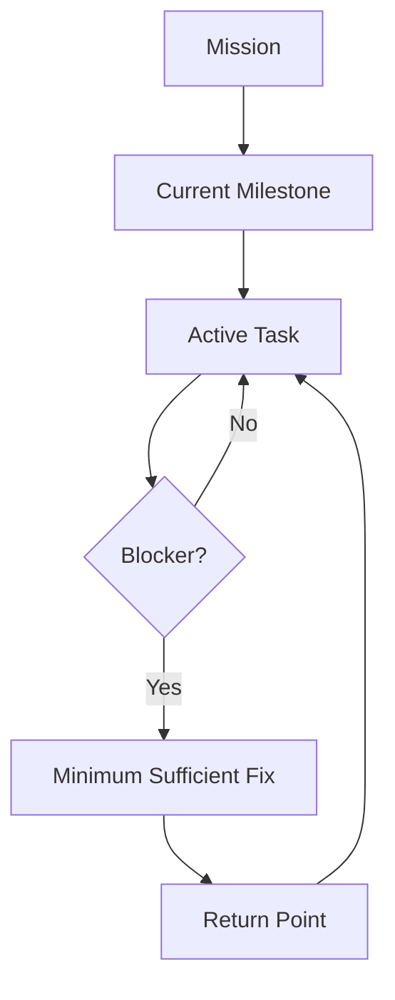

# Preserve Project Intent — GPT / Codex / Claude Code Skill

[](https://github.com/okita1981/preserve-project-intent/actions/workflows/verify.yml)

長期・並列化するAIプロジェクトで、途中に見つかった課題や是正作業が本来の目的へすり替わることを防ぐための、GPT / Codex / Claude Code共通のAgent Skillです。

Mission、Milestone、Active Task、Blocker、Return Pointを分離し、Blockerを必要十分な範囲で解消した後、必ず本線へ戻します。下位TaskやBlockerの完了を、MilestoneやMissionの完了とはみなしません。

各プラットフォームの会話履歴、プロジェクトメモリ、並列実行機能とは競合しません。それらが「作業を継続する仕組み」だとすれば、このSkillは「継続する作業を本来の成果へ向け続けるための統制層」です。セッションやプラットフォームを跨ぐ場合は、詳細な引き継ぎ正本と次セッション用の起動プロンプトを作り、GPT、Codex、Claude Codeの間でも現在地と本来の目的を維持します。

## なぜ必要か

AIエージェントが長時間・並列に作業できても、各作業が本来の成果へ収束するとは限りません。長期プロジェクトでは、次のような目的のすり替わりが起きやすくなります。

```text
本来の成果へ進む
  → 途中でBlockerを発見する
  → Blockerの修正中に別の問題を発見する
  → 是正機構そのものの完全性を追求する
  → Blockerが解消する
  → 局所作業の完了を「プロジェクト完了」と誤認する
```

このSkillは、課題を放置するためのものではありません。課題を本線との関係で分類し、必要なものは解決し、隣接課題や過剰対策は分離し、解決後の復帰地点を失わないための制御層です。



## 中核概念

| 層 | 意味 | 完了の扱い |
|---|---|---|
| Mission | プロジェクトが最終的に作る価値 | `MISSION_COMPLETE` |
| Milestone | 現在狙っている測定可能な成果 | `MILESTONE_COMPLETE` |
| Active Task | 今回実行する限定された作業 | `TASK_COMPLETE` |
| Blocker | 本線を安全・正確に進めるのを妨げる条件 | `BLOCKER_CLEARED` |
| Return Point | Blocker解消後に戻る本線上の地点 | 次のActive Taskへ復帰 |

下位の完了から上位の完了を推論しません。たとえば`BLOCKER_CLEARED`は、`MILESTONE_COMPLETE`や`MISSION_COMPLETE`を意味しません。

## 4つのモード

| モード | 使用場面 | 主な出力 |
|---|---|---|
| `INIT` | 長期プロジェクトの開始・再定義 | Mission、Milestone、成功条件、指標、Non-goals、状態永続化の選択 |
| `CONTROL` | 実行中・レビュー中・是正中 | 課題分類、minimum resolution、Return Point |
| `HANDOFF` | セッション終了時 | 詳細な引き継ぎ正本`.md`＋次セッション用プロンプト |
| `RESUME` | 新セッション開始時 | 現在地の理解確認、矛盾検出、本線の再開地点 |

最初に継続プロジェクトの存在を判定します。継続の意図がなければSkillを使用しません。過去作業の継続が意図されている一方、Missionや現在地を推測せず回収できる正本がない場合は、RESUMEやINITを装わず`ROUTING: ASK_FOR_STATE`としてhandoff、stateファイル、または正本を求めます。

Skill適用時の最初の状態報告では`MODE: INIT`、`MODE: CONTROL`、`MODE: HANDOFF`、`MODE: RESUME`のいずれかを宣言します。明示的に呼び出されたものの対象外だった場合だけ`ROUTING: NOT_APPLICABLE`を返します。

### 派生課題の分類

| 分類 | 扱い |
|---|---|
| `BLOCKING` | 解消しないと本線を安全・正確に進められない。必要十分な範囲で解決する |
| `REQUIRED` | 合意済みの受入条件を満たすために必要。現在のTaskへ含める |
| `ADJACENT` | 関連はあるが本線を止めない。Parking Lotへ送る |
| `OVERREACH` | 一般化・完全防止・過剰検証。簡素化または停止する |

派生課題の中からさらに課題が見つかった場合や、新しい解析基盤・汎用機構が必要になった場合は、無条件に進めずScope Expansion Checkpointを行います。

原因診断後、`minimum_resolution`、`evidence_to_clear`、`return_point`、`non_goals`をBlocker契約として最初に記録した時点で凍結します。新しい証拠によって変更が必要になった場合も、Agentの自己判断では拡張せず、変更前後・理由・影響を示してユーザーの明示承認を得ます。

派生深度は、本線をDepth 0、直接のBlockerをDepth 1、Blocker内で見つかった課題をDepth 2として扱います。Depth 2は必ずCheckpoint、Depth 3以上は原則Parkingです。同じDepth 1解決策からDepth 2が3件出た場合は個別処理を止め、解決策そのものを簡素化・置換・撤去できないか再検討します。

## ネイティブな継続機能との関係

会話履歴、プロジェクトメモリ、クラウド実行、並列スレッドなどは、作業を長く継続するための実行基盤です。このSkillは、それらの代替ではなく、Mission、完了境界、Blockerの必要十分性、Return Pointを明示して目的ドリフトを防ぐ統制層です。

ホストが提供するメモリ機能は、承認された場合にProject Stateの保存先として利用できます。ただし、保存された情報の存在だけから本線との整合や上位レベルの完了を推論しません。ホスト固有の機能を前提にせず、同じ中核ルールをGPT、Codex、Claude Codeで適用します。

## セッションやプラットフォームを跨ぐ仕組み

Skill自体は、特定プロジェクトの現在地を永続記憶しません。次の3点を分離します。

| 要素 | 役割 |
|---|---|
| Skill | 本線を保つための共通ルール |
| 引き継ぎ正本 | プロジェクト固有の前提・現在地・未完了・Return Point |
| 起動プロンプト | 新セッションでSkillと引き継ぎ正本を正しく読み込ませる |

HANDOFFモードは、単なる時系列要約ではなく、冒頭に機械可読なCanonical Stateを持つ詳細な`.md`を作ります。RESUMEモードは全文を確認し、変更を始める前にMission、Milestone、定量的な現在地、完了済み、未完了、Blocker状態、Return Pointを返します。

RESUMEの整合判定は、正本を機械的に1件以上照合した`HANDOFF_ALIGNED_WITH_ARTIFACTS`と、文書内部だけを確認した`HANDOFF_INTERNALLY_CONSISTENT_ONLY`を分離します。正本へアクセスできない場合に、外部照合済みとは主張しません。

### 任意の状態永続化

INITでは、状態永続化を有効にするか一度だけ確認し、`.preserve-intent/state.yaml`などのProject State正本候補を提示します。承認または辞退の結果を現在のCanonical Stateへ記録し、同じ初期化について繰り返し質問しません。複数セッション、並列Agent、無人実行、auto-compactionを伴う長期プロジェクトでは利用を強く推奨します。

既定はOFFであり、Skillの適用や推奨だけからファイル変更権限を推論しません。有効化した場合も、Milestone変更、Blocker開始・解消、Return Point変更、HANDOFFなどの重要な遷移時だけ更新し、commit、push、deployや外部変更の権限は付与しません。

Blockerの`depth2_findings`には、同じDepth 1解決策から発生した派生課題を解決済み・Parking済みも含めて保持します。件数は一覧から導出し、HANDOFFを跨いでもBreadth limitをリセットしません。

## 使い方

### INIT

```text
$preserve-project-intent を使用して、このプロジェクトのMission、現在のMilestone、成功条件、現在地、Non-goalsを固定してください。
```

### CONTROL

```text
$preserve-project-intent を使用し、今回見つかった問題が本線を止めるBlockerか、隣接課題か、過剰対策かを判定してください。必要ならminimum resolutionとReturn Pointを固定してください。
```

### HANDOFF

```text
$preserve-project-intent のHANDOFFモードを使用し、次セッションへ渡す詳細な引き継ぎ正本.mdと、新セッション冒頭に貼る起動プロンプトを作成してください。
```

### RESUME

```text
$preserve-project-intent のRESUMEモードを使用し、添付した引き継ぎ正本を全文確認してください。実装やProduction操作はまだ行わず、Mission、Milestone、定量的な現在地、完了済み、未完了、Blocker状態、Return Point、最初の本線作業を報告してください。
```

## Codex / ChatGPT

正本は[`skills/preserve-project-intent/`](skills/preserve-project-intent)です。明示的に呼び出す場合は`$preserve-project-intent`を使用します。`description`に一致する長期プロジェクトでは暗黙に選択されることもありますが、開始・引き継ぎ・再開時は明示的な呼び出しを推奨します。

### Codexプラグインとして使う

Codex向けPluginは[`plugins/preserve-project-intent/`](plugins/preserve-project-intent)、リポジトリMarketplace定義は[`.agents/plugins/marketplace.json`](.agents/plugins/marketplace.json)です。

```bash
git clone https://github.com/okita1981/preserve-project-intent.git
cd preserve-project-intent
codex plugin marketplace add .
codex plugin add preserve-project-intent@preserve-project-intent
```

## Claude Code

Claude Code向けproject skillを[`.claude/skills/preserve-project-intent/`](.claude/skills/preserve-project-intent)へ収録しています。`SKILL.md`と`references/`はGPT / Codex版の正本と同一です。

### Project skillとして使う

```bash
git clone https://github.com/okita1981/preserve-project-intent.git
cd preserve-project-intent
claude
```

### Personal skillとして使う

macOS / Linux:

```bash
git clone https://github.com/okita1981/preserve-project-intent.git
cd preserve-project-intent
mkdir -p ~/.claude/skills
cp -r .claude/skills/preserve-project-intent ~/.claude/skills/
```

Windows PowerShell:

```powershell
git clone https://github.com/okita1981/preserve-project-intent.git
cd preserve-project-intent
New-Item -ItemType Directory -Force ~/.claude/skills | Out-Null
Copy-Item -Recurse -Force .claude/skills/preserve-project-intent ~/.claude/skills/
```

明示的に呼び出す場合は、Claude Codeでは`/preserve-project-intent`を使用します。

```text
/preserve-project-intent のHANDOFFモードを使用し、次セッションへ渡す詳細な引き継ぎ正本と起動プロンプトを作成してください。
```

Claude Code Plugin向けパッケージも[`plugin/preserve-project-intent/`](plugin/preserve-project-intent)に収録しています。ローカル確認では次のように読み込めます。

```bash
claude --plugin-dir ./plugin/preserve-project-intent
```

Plugin経由ではスキル名が名前空間化されます。正式な呼び出し名は次のとおりです。

```text
/preserve-project-intent:preserve-project-intent
```

競合がなければ短縮形`/preserve-project-intent`も使用できますが、ドキュメントや自動化では正式名を推奨します。

### Claude Code Marketplaceから使う

リポジトリルートの[`.claude-plugin/marketplace.json`](.claude-plugin/marketplace.json)をClaude Code Marketplace定義として使用できます。

```text
/plugin marketplace add okita1981/preserve-project-intent
/plugin install preserve-project-intent@preserve-project-intent
```

### Claude Projects / claude.aiで使う

Claude公式ドキュメントでは、Claude Projectsの各ThreadであるCloud Sessionは、Projectに登録したGitHubリポジトリ内の`.claude/skills/`を読み込む仕様です。このリポジトリをProjectへ登録した場合、収録済みのProject Skillが利用対象になります。

このリポジトリ以外のProject、Cowork、またはリポジトリを持たない作業で個人Skillとして使う場合は、`skills/preserve-project-intent/`をzip化してclaude.aiのSettingsからアップロードします。claude.aiへアップロードしたSkillはユーザーアカウント単位で管理され、Claude CodeのローカルSkillとは別に配布されます。現在の正本フロントマターは、claude.aiで許可される`name`と`description`だけを使用しています。

現時点の確認状況は次のとおりです。`DOCUMENTED`はClaude公式仕様で確認済み、`NOT_YET_TESTED`はこのリポジトリを使った実機確認が未実施という意味です。

| 確認項目 | 公式仕様 | このリポジトリでの実機確認 |
|---|---|---|
| Project登録リポジトリの`.claude/skills/`検出 | `DOCUMENTED` | `NOT_YET_TESTED` |
| Skillからの`references/`解決 | supporting filesとして`DOCUMENTED` | `NOT_YET_TESTED` |
| リポジトリ経由で適用されるfrontmatter検証経路 | Claude Code Skillとして`DOCUMENTED` | `NOT_YET_TESTED` |
| claude.ai zipアップロードの6フィールド制約 | `DOCUMENTED` | `NOT_YET_TESTED` |

## 正本と同期方針

唯一の編集正本は[`skills/preserve-project-intent/`](skills/preserve-project-intent)です。以下は正本から生成する派生コピーです。

- `.claude/skills/preserve-project-intent/`
- `plugins/preserve-project-intent/skills/preserve-project-intent/`
- `plugin/preserve-project-intent/skills/preserve-project-intent/`

正本を更新した場合は、次を実行します。

```bash
python scripts/sync-distributions.py
python scripts/sync-distributions.py --check
python scripts/verify.py
```

`scripts/verify.py`はClaude CLIが利用可能な環境では、`claude plugin validate`によってMarketplaceとClaude Code Pluginも検証します。CIではClaude CLIを必須にし、公式validatorを省略しません。

### 挙動評価

Claude Code Pluginの`evals/`には、次の独立した評価指標を収録しています。

- `BLOCKER_CLEARED`を`MILESTONE_COMPLETE`と誤認しない
- Depth 2 findingでscope-expansion checkpointを出す
- Blocker解消後に凍結済みReturn Pointへ戻る
- 状態不足のRESUMEで推測せず`ASK_FOR_STATE`を返す
- Artifactへアクセスできない正常RESUMEで内部整合性だけを宣言し、凍結済みReturn Pointへ戻る
- INITで状態永続化の選択を一度確認する
- 無関係な単発作業ではSkillを発火しない

Claude Code v2.1.269以降で、Pluginディレクトリから実行します。

最初にRESUME正常系だけを1回実行し、`--keep-temp`が表示するsandbox内で`resources/handoff.md`のReadが成功したことをtranscriptから確認します。

```bash
cd plugin/preserve-project-intent
claude plugin eval . --case resume-internal-consistency --model claude-sonnet-5 --runs 1 --ablation none --keep-temp --no-publish
```

fixture解決を確認した後、全ケースを1 arm・1 runでsmoke testします。

```bash
claude plugin eval . --model claude-sonnet-5 --runs 1 --ablation none --keep-temp --no-publish
```

smoke testが通った後、既定の3 runs × 2 armsで基準値を取得します。

```bash
cd plugin/preserve-project-intent
claude plugin eval . --model claude-sonnet-5
```

`claude-sonnet-5`は単一の固定snapshotを指すモデルIDで、Skill変更前後の差を同じ条件で比較するための再現用基準です。現行モデルとの互換性を確認するときは、同じevalを`--model sonnet`でも補助的に実行します。Plugin evalは実モデルを呼び出し、プラン使用量またはAPI料金を消費します。そのため通常のpush / PRでは自動実行せず、リリース前またはSkill設計のA/B比較時に手動で実行します。`evals/results/`はGit管理しません。

RESUMEの読み取り専用Skill分割は、正常系evalの基準値を取得してから同じモデル・fixtureでA/B比較します。分割版が正確性を改善し、発火や利用方法を悪化させないことを確認するまでは現行構成を維持します。

## ディレクトリ構成

```text
skills/preserve-project-intent/          GPT / Codex向け正本
.claude/skills/preserve-project-intent/  Claude Code project skill
plugins/preserve-project-intent/         Codex Plugin
plugin/preserve-project-intent/          Claude Code Plugin
.agents/plugins/marketplace.json         Codex向けMarketplace定義
.claude-plugin/marketplace.json          Claude Code向けMarketplace定義
scripts/                                 同期・構造・同一性の検証
fixtures/                                将来の発火評価に使う入力fixture
plugin/preserve-project-intent/evals/    Claude Pluginの挙動評価
.github/workflows/verify.yml             push / PRごとのCI
```

## 制約

- 自動発動は各ホストの選択を含むため、100%は保証されません。重要な開始・引き継ぎ・再開では明示的に呼び出してください。
- `fixtures/trigger-cases.json`は将来の実モデル評価用データです。CIはファイル構造だけを確認し、Skillの発火精度やモデル挙動を評価していません。
- Skillだけでプロジェクト固有の状態は永続化されません。引き継ぎ正本またはプロジェクトのCanonical Stateを維持してください。
- 状態永続化はオプトインですが、複数セッション、並列Agent、無人実行、auto-compactionを伴う場合は強く推奨します。保存先とファイル変更が承認されていない場合、Skillは状態ファイルを書きません。
- 永続状態を使用しない長期セッションでは、会話のcompaction後にBlocker契約、Depth 2 findings、breadth判定、Return Pointなどのプロジェクト固有状態が要約・欠落する可能性があります。重要な遷移前にHANDOFFを作るか、承認済みのProject State正本を使用してください。
- このSkillは、必要な安全対策や検証を省略するためのものではありません。本線との関係とリスクに比例した必要十分性を判断します。

## Author

Kousuke Okita / 沖田紘亮

## License

Skill本文、supporting references、README、eval promptとgraderは[Creative Commons Attribution 4.0 International](LICENSE)で提供します。Pythonスクリプト、CI workflow、plugin／marketplace manifestなどのソフトウェアおよび機械可読設定は[MIT License](LICENSE-CODE)で提供します。
