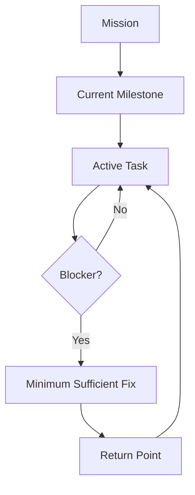

# Preserve Project Intent — GPT / Codex / Claude Code Skill

[](https://github.com/okita1981/preserve-project-intent/actions/workflows/verify.yml)

長期プロジェクトで、途中に見つかった課題や是正作業が本来の目的へすり替わることを防ぐためのAgent Skillです。

Mission、Milestone、Active Task、Blocker、Return Pointを分離し、Blockerを必要十分な範囲で解消した後、必ず本線へ戻します。セッションを跨ぐ場合は、詳細な引き継ぎ正本と次セッション用の起動プロンプトを作り、GPT、Codex、Claude Codeの間でも現在地を維持します。

## なぜ必要か

長期プロジェクトでは、次のような目的のすり替わりが起きやすくなります。

```text
本来の成果へ進む
  → 途中でBlockerを発見する
  → Blockerの修正中に別の問題を発見する
  → 是正機構そのものの完全性を追求する
  → Blockerが解消する
  → 局所作業の完了を「プロジェクト完了」と誤認する
```

このSkillは、課題を放置するためのものではありません。課題を本線との関係で分類し、必要なものは解決し、隣接課題や過剰対策は分離し、解決後の復帰地点を失わないための制御層です。



## 中核概念

| 層 | 意味 | 完了の扱い |
|---|---|---|
| Mission | プロジェクトが最終的に作る価値 | `MISSION_COMPLETE` |
| Milestone | 現在狙っている測定可能な成果 | `MILESTONE_COMPLETE` |
| Active Task | 今回実行する限定された作業 | `TASK_COMPLETE` |
| Blocker | 本線を安全・正確に進めるのを妨げる条件 | `BLOCKER_CLEARED` |
| Return Point | Blocker解消後に戻る本線上の地点 | 次のActive Taskへ復帰 |

下位の完了から上位の完了を推論しません。たとえば`BLOCKER_CLEARED`は、`MILESTONE_COMPLETE`や`MISSION_COMPLETE`を意味しません。

## 4つのモード

| モード | 使用場面 | 主な出力 |
|---|---|---|
| `INIT` | 長期プロジェクトの開始・再定義 | Mission、Milestone、成功条件、指標、Non-goals |
| `CONTROL` | 実行中・レビュー中・是正中 | 課題分類、minimum resolution、Return Point |
| `HANDOFF` | セッション終了時 | 詳細な引き継ぎ正本`.md`＋次セッション用プロンプト |
| `RESUME` | 新セッション開始時 | 現在地の理解確認、矛盾検出、本線の再開地点 |

### 派生課題の分類

| 分類 | 扱い |
|---|---|
| `BLOCKING` | 解消しないと本線を安全・正確に進められない。必要十分な範囲で解決する |
| `REQUIRED` | 合意済みの受入条件を満たすために必要。現在のTaskへ含める |
| `ADJACENT` | 関連はあるが本線を止めない。Parking Lotへ送る |
| `OVERREACH` | 一般化・完全防止・過剰検証。簡素化または停止する |

派生課題の中からさらに課題が見つかった場合や、新しい解析基盤・汎用機構が必要になった場合は、無条件に進めずScope Expansion Checkpointを行います。

Blocker作業を開始した時点で、`minimum_resolution`、`evidence_to_clear`、`return_point`、`non_goals`を凍結します。新しい証拠によって変更が必要になった場合も、Agentの自己判断では拡張せず、変更前後・理由・影響を示してユーザーの明示承認を得ます。

派生深度は、本線をDepth 0、直接のBlockerをDepth 1、Blocker内で見つかった課題をDepth 2として扱います。Depth 2は必ずCheckpoint、Depth 3以上は原則Parkingです。

## セッションを跨ぐ仕組み

Skill自体は、特定プロジェクトの現在地を永続記憶しません。次の3点を分離します。

| 要素 | 役割 |
|---|---|
| Skill | 本線を保つための共通ルール |
| 引き継ぎ正本 | プロジェクト固有の前提・現在地・未完了・Return Point |
| 起動プロンプト | 新セッションでSkillと引き継ぎ正本を正しく読み込ませる |

HANDOFFモードは、単なる時系列要約ではなく、冒頭に機械可読なCanonical Stateを持つ詳細な`.md`を作ります。RESUMEモードは全文を確認し、変更を始める前にMission、Milestone、定量的な現在地、完了済み、未完了、Blocker状態、Return Pointを返します。

RESUMEの整合判定は、正本を機械的に1件以上照合した`HANDOFF_ALIGNED_WITH_ARTIFACTS`と、文書内部だけを確認した`HANDOFF_INTERNALLY_CONSISTENT_ONLY`を分離します。正本へアクセスできない場合に、外部照合済みとは主張しません。

### 任意の状態永続化

長期プロジェクトでは、INIT時に保存先を承認して、`.preserve-intent/state.yaml`などをProject State正本として使用できます。既定はOFFです。有効化した場合も、Milestone変更、Blocker開始・解消、Return Point変更、HANDOFFなどの重要な遷移時だけ更新し、commit、push、deployや外部変更の権限は付与しません。

## 使い方

### INIT

```text
$preserve-project-intent を使用して、このプロジェクトのMission、現在のMilestone、成功条件、現在地、Non-goalsを固定してください。
```

### CONTROL

```text
$preserve-project-intent を使用し、今回見つかった問題が本線を止めるBlockerか、隣接課題か、過剰対策かを判定してください。必要ならminimum resolutionとReturn Pointを固定してください。
```

### HANDOFF

```text
$preserve-project-intent のHANDOFFモードを使用し、次セッションへ渡す詳細な引き継ぎ正本.mdと、新セッション冒頭に貼る起動プロンプトを作成してください。
```

### RESUME

```text
$preserve-project-intent のRESUMEモードを使用し、添付した引き継ぎ正本を全文確認してください。実装やProduction操作はまだ行わず、Mission、Milestone、定量的な現在地、完了済み、未完了、Blocker状態、Return Point、最初の本線作業を報告してください。
```

## Codex / ChatGPT

正本は[`skills/preserve-project-intent/`](skills/preserve-project-intent)です。明示的に呼び出す場合は`$preserve-project-intent`を使用します。`description`に一致する長期プロジェクトでは暗黙に選択されることもありますが、開始・引き継ぎ・再開時は明示的な呼び出しを推奨します。

### Codexプラグインとして使う

Codex向けPluginは[`plugins/preserve-project-intent/`](plugins/preserve-project-intent)、リポジトリMarketplace定義は[`.agents/plugins/marketplace.json`](.agents/plugins/marketplace.json)です。

```bash
git clone https://github.com/okita1981/preserve-project-intent.git
cd preserve-project-intent
codex plugin marketplace add .
codex plugin add preserve-project-intent@preserve-project-intent
```

## Claude Code

Claude Code向けproject skillを[`.claude/skills/preserve-project-intent/`](.claude/skills/preserve-project-intent)へ収録しています。`SKILL.md`と`references/`はGPT / Codex版の正本と同一です。

### Project skillとして使う

```bash
git clone https://github.com/okita1981/preserve-project-intent.git
cd preserve-project-intent
claude
```

### Personal skillとして使う

macOS / Linux:

```bash
git clone https://github.com/okita1981/preserve-project-intent.git
cd preserve-project-intent
mkdir -p ~/.claude/skills
cp -r .claude/skills/preserve-project-intent ~/.claude/skills/
```

Windows PowerShell:

```powershell
git clone https://github.com/okita1981/preserve-project-intent.git
cd preserve-project-intent
New-Item -ItemType Directory -Force ~/.claude/skills | Out-Null
Copy-Item -Recurse -Force .claude/skills/preserve-project-intent ~/.claude/skills/
```

明示的に呼び出す場合は、Claude Codeでは`/preserve-project-intent`を使用します。

```text
/preserve-project-intent のHANDOFFモードを使用し、次セッションへ渡す詳細な引き継ぎ正本と起動プロンプトを作成してください。
```

Claude Code Plugin向けパッケージも[`plugin/preserve-project-intent/`](plugin/preserve-project-intent)に収録しています。ローカル確認では次のように読み込めます。

```bash
claude --plugin-dir ./plugin/preserve-project-intent
```

## 正本と同期方針

唯一の編集正本は[`skills/preserve-project-intent/`](skills/preserve-project-intent)です。以下は正本から生成する派生コピーです。

- `.claude/skills/preserve-project-intent/`
- `plugins/preserve-project-intent/skills/preserve-project-intent/`
- `plugin/preserve-project-intent/skills/preserve-project-intent/`

正本を更新した場合は、次を実行します。

```bash
python scripts/sync-distributions.py
python scripts/sync-distributions.py --check
python scripts/verify.py
```

## ディレクトリ構成

```text
skills/preserve-project-intent/          GPT / Codex向け正本
.claude/skills/preserve-project-intent/  Claude Code project skill
plugins/preserve-project-intent/         Codex Plugin
plugin/preserve-project-intent/          Claude Code Plugin
.agents/plugins/marketplace.json         Codex向けMarketplace定義
scripts/                                 同期・構造・同一性の検証
evals/                                   発火すべき／すべきでない入力fixture
.github/workflows/verify.yml             push / PRごとのCI
```

## 制約

- 自動発動は各ホストの選択を含むため、100%は保証されません。重要な開始・引き継ぎ・再開では明示的に呼び出してください。
- Skillだけでプロジェクト固有の状態は永続化されません。引き継ぎ正本またはプロジェクトのCanonical Stateを維持してください。
- 状態永続化はオプトインです。保存先とファイル変更が承認されていない場合、Skillは状態ファイルを書きません。
- このSkillは、必要な安全対策や検証を省略するためのものではありません。本線との関係とリスクに比例した必要十分性を判断します。

## Author

Kousuke Okita / 沖田紘亮

## License

このリポジトリの文書・Skillは、特記がない限り[Creative Commons Attribution 4.0 International](LICENSE)で提供します。利用・改変・再配布の際は、著作者と本リポジトリへの適切なクレジットを表示してください。
